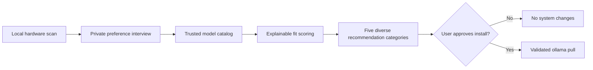

<p align="center">
  
</p>

<h1 align="center">Mustakshif</h1>

<p align="center">
  <strong>Stop guessing which local AI model your PC can actually run.</strong>
</p>

<p align="center">
  A privacy-first Windows app and CLI that scans your hardware, understands your
  goals, and recommends the best trusted open AI model for your device.
</p>

<p align="center">
  <a href="https://github.com/SultanAlfaifi/mustakshif/actions/workflows/ci.yml"></a>
  <a href="https://github.com/SultanAlfaifi/mustakshif/releases/latest"></a>
  <a href="LICENSE"></a>
  
  
</p>

<p align="center">
  <a href="https://github.com/SultanAlfaifi/mustakshif/releases/latest"><strong>Download for Windows</strong></a>
  &nbsp;•&nbsp;
  <a href="docs/RECOMMENDATION_METHODOLOGY.md"><strong>How scoring works</strong></a>
</p>

## Why this exists

Choosing a local model is harder than comparing parameter counts. GPU memory,
system RAM, disk space, context length, language, task type, quantization, and
runtime overhead all matter. Mustakshif turns those constraints into
clear, explainable recommendations.

Its friendly desktop experience serves beginners, while the companion CLI gives
developers transparent scoring, offline behavior, automation, and JSON output.

## What it does

- Detects Windows, CPU, cores, RAM, GPU, dedicated VRAM, free VRAM, storage,
  and the local Ollama installation.
- Asks about experience, goals, Arabic or English usage, speed, quality,
  context size, vision, tool calling, privacy, and license preferences.
- Downloads a small, daily-generated index of every runnable family in the
  official Ollama library; the application never downloads model weights by
  itself.
- Scores hardware fit, task fit, language fit, speed, quality, official pull
  adoption, and catalog freshness with the same rules for every publisher.
- Presents five useful perspectives: best overall, best quality, fastest,
  lightest, and most popular compatible option.
- Recommends local Ollama models and clearly labels optional cloud models.
- Refreshes model metadata only from allowlisted official HTTPS sources.
- Works offline through a trusted local cache and bundled fallback catalog.
- Requires explicit confirmation before running `ollama pull`.
- Exposes JSON output for scripts, inventories, and future agent workflows.

## Two ways to use Mustakshif

**Mustakshif Desktop** provides a guided visual experience: device scan,
preference interview, an animated official-source search, explainable result
cards, clickable model pages, copyable commands, and approval-gated Ollama
installation.

**Mustakshif CLI** exposes the same hardware scanner, trusted catalog, and
recommendation engine for developers, scripts, and automated workflows. The two
interfaces share one engine, so their results remain consistent.

## How it works



Hardware and answers stay on the computer. Scanning and recommendation do not
download models or modify the system.

For formulas, weights, compatibility filters, confidence rules, and a complete
worked example, read the
[Recommendation Methodology](docs/RECOMMENDATION_METHODOLOGY.md).

## Install on Windows

### Recommended: graphical installer

Download `Mustakshif-Setup-0.4.0.exe` from the
[latest release](https://github.com/SultanAlfaifi/mustakshif/releases/latest).
The per-user installer adds the CLI to PATH, creates a Desktop app shortcut, and
does not require administrator privileges.

Launch **Mustakshif** from the Start menu, or open a new PowerShell or Windows
Terminal window and run:

```powershell
mustakshif
```

### Portable ZIP

Download the Windows ZIP, extract it, and run:

```powershell
.\Mustakshif.exe
```

The package also includes `Install-Mustakshif.ps1`,
`Uninstall-Mustakshif.ps1`, and the CLI under `cli\mustakshif.exe`.

> [!IMPORTANT]
> Version 0.4.0 is unsigned. Windows SmartScreen may display an
> unrecognized-publisher warning. Verify downloads with the published SHA-256
> checksums. Code signing is planned before the first stable release.

## Commands

```text
mustakshif                         Interactive advisor
mustakshif scan                    Inspect hardware only
mustakshif recommend               Run the recommendation wizard
mustakshif update                  Refresh official model data
mustakshif list                    List trusted models
mustakshif --offline recommend     Use cached or bundled data only
mustakshif explain qwen3.5:9b      Explain one model
mustakshif open gemma4:12b         Open an official model page
mustakshif install qwen3.5:9b      Confirm and install through Ollama
mustakshif --json scan             Return machine-readable output
mustakshif about                   Show project and creator details
```

## Complete, automatically updated model catalog

A scheduled GitHub Actions workflow scans the complete official Ollama library
every day. It verifies runnable family pages and their canonical variants, then
publishes a compact `data/catalog.json` index containing model size, context,
capabilities, license evidence, official pull count, update date, and safe
official links. The current bundled index contains hundreds of runnable
variants, not a hand-picked publisher shortlist.

On startup, Mustakshif downloads only that small trusted JSON index when the
local copy is missing or more than 24 hours old. It validates every identifier,
URL, publisher host, numeric field, and install command before using it. If the
network is unavailable, the app falls back to the last trusted cache and then
to the catalog bundled inside the executable.

All publishers go through identical metadata rules and the same scoring
formula. There is no Qwen, Gemma, Kimi, Meta, Google, or other publisher bonus.
Official Ollama pulls are used only as a capped adoption signal worth at most
5% of the score; Ollama does not publish a comparable star-rating or user-review
score. Missing metadata lowers confidence or creates a visible warning rather
than a hidden ranking penalty.

If a license cannot be verified from the official page, the result says so
instead of claiming that the model is open source. Selecting the
permissive-license filter excludes models whose license is not verified. See
the [Recommendation Methodology](docs/RECOMMENDATION_METHODOLOGY.md) for the
full formulas and limitations.

## Privacy and security

- No telemetry.
- No hardware uploads.
- No background model downloads.
- Strict HTTPS domain and publisher allowlists.
- Strict model identifier validation.
- Process argument arrays instead of shell interpolation.
- Explicit approval before model installation.
- Offline cache and fallback behavior that fails safely.

Read [SECURITY.md](SECURITY.md) before reporting a vulnerability. Model
publishers may update weights, licenses, sizes, or terms; always review the
official model page before production or commercial use.

## Run from source

Python 3.10 or newer is required.

```powershell
git clone https://github.com/SultanAlfaifi/mustakshif.git
cd mustakshif
python -m venv .venv
.\.venv\Scripts\python.exe -m pip install -e ".[desktop]"
.\.venv\Scripts\mustakshif-desktop.exe
.\.venv\Scripts\mustakshif.exe
```

## Test

```powershell
.\.venv\Scripts\python.exe -m unittest discover -s tests -v
```

## Build the executable

```powershell
.\.venv\Scripts\python.exe -m pip install -e ".[dev]"
.\.venv\Scripts\pyinstaller.exe --noconfirm --clean --onefile --windowed `
  --name Mustakshif --icon .\assets\mustakshif.ico `
  --add-data ".\assets\mustakshif-icon.png;assets" `
  --add-data ".\data\catalog.json;data" `
  --version-file .\version_info.txt .\desktop_launcher.py

.\.venv\Scripts\pyinstaller.exe --noconfirm --clean --onefile --console `
  --name mustakshif --icon .\assets\mustakshif.ico `
  --add-data ".\data\catalog.json;data" `
  --version-file .\version_info.txt .\launcher.py
```

The reproducible installer definition is available at
[`installer/Mustakshif.iss`](installer/Mustakshif.iss).

## Roadmap

- [ ] Digitally signed Windows releases.
- [x] Native Windows desktop experience alongside the CLI.
- [x] Dynamic discovery across the complete official Ollama library.
- [ ] Additional official model-provider adapters beyond Ollama.
- [ ] AMD and Intel GPU memory detection improvements.
- [ ] Linux and macOS support.
- [ ] Benchmark-backed recommendation calibration.
- [ ] WinGet distribution.

Ideas and contributions are welcome. Start with
[CONTRIBUTING.md](CONTRIBUTING.md), open a focused issue, or submit a small pull
request with tests.

## Project governance

- [Contributing guide](CONTRIBUTING.md)
- [Code of Conduct](CODE_OF_CONDUCT.md)
- [Security policy](SECURITY.md)
- [Recommendation methodology](docs/RECOMMENDATION_METHODOLOGY.md)
- [Changelog](CHANGELOG.md)
- [Trademark policy](TRADEMARKS.md)

## License and trademark

The source code is licensed under the [Apache License 2.0](LICENSE). See
[NOTICE](NOTICE) for attribution.

The name **Mustakshif**, its product identity, and associated visual
branding remain trademarks of Sultan Alfaifi and are not granted by the Apache
license. See [TRADEMARKS.md](TRADEMARKS.md).

---

<p align="center">
  Created by <a href="https://github.com/SultanAlfaifi">Sultan Alfaifi</a> ·
  <a href="https://x.com/SultAlfaifi">X</a> ·
  <a href="https://www.linkedin.com/in/alfaifi-sultan/">LinkedIn</a>
</p>
