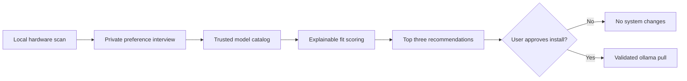

<p align="center">
  
</p>

<h1 align="center">Alfaifi Model Advisor</h1>

<p align="center">
  <strong>Stop guessing which local AI model your PC can actually run.</strong>
</p>

<p align="center">
  A privacy-first Windows CLI that scans your hardware, understands your goals,
  and recommends the best trusted open AI model for your device.
</p>

<p align="center">
  <a href="https://github.com/SultanAlfaifi/alfaifi-model-advisor/actions/workflows/ci.yml"></a>
  <a href="https://github.com/SultanAlfaifi/alfaifi-model-advisor/releases/latest"></a>
  <a href="LICENSE"></a>
  
  
</p>

## Why this exists

Choosing a local model is harder than comparing parameter counts. GPU memory,
system RAM, disk space, context length, language, task type, quantization, and
runtime overhead all matter. Alfaifi Model Advisor turns those constraints into
clear, explainable recommendations.

It is designed for beginners who want a safe answer and advanced users who want
transparent scoring, trusted sources, offline behavior, and JSON output.

## What it does

- Detects Windows, CPU, cores, RAM, GPU, dedicated VRAM, free VRAM, storage,
  and the local Ollama installation.
- Asks about experience, goals, Arabic or English usage, speed, quality,
  context size, vision, tool calling, privacy, and license preferences.
- Reads the complete official Ollama library after the interview, then verifies
  exact sizes and context windows for the most relevant families.
- Scores hardware fit, task fit, language fit, and execution mode.
- Recommends local Ollama models and clearly labels optional cloud models.
- Refreshes model metadata only from allowlisted official HTTPS sources.
- Works offline through a trusted local cache and bundled fallback catalog.
- Requires explicit confirmation before running `ollama pull`.
- Exposes JSON output for scripts, inventories, and future agent workflows.

## How it works



Hardware and answers stay on the computer. Scanning and recommendation do not
download models or modify the system.

## Install on Windows

### Recommended: graphical installer

Download `AlfaifiModelAdvisor-Setup-0.2.0.exe` from the
[latest release](https://github.com/SultanAlfaifi/alfaifi-model-advisor/releases/latest).
The installer works for the current user, adds `alfaifi` to the user PATH, and
does not require administrator privileges.

Open a new PowerShell or Windows Terminal window and run:

```powershell
alfaifi
```

### Portable ZIP

Download the Windows ZIP, extract it, and run:

```powershell
.\alfaifi.exe
```

The package also includes `Install-Alfaifi.ps1` and `Uninstall-Alfaifi.ps1`.

> [!IMPORTANT]
> Version 0.2.0 is unsigned. Windows SmartScreen may display an
> unrecognized-publisher warning. Verify downloads with the published SHA-256
> checksums. Code signing is planned before the first stable release.

## Commands

```text
alfaifi                         Interactive advisor
alfaifi scan                    Inspect hardware only
alfaifi recommend               Run the recommendation wizard
alfaifi update                  Refresh official model data
alfaifi list                    List trusted models
alfaifi --offline recommend     Use cached or bundled data only
alfaifi explain qwen3.5:9b      Explain one model
alfaifi open gemma4:12b         Open an official model page
alfaifi install qwen3.5:9b      Confirm and install through Ollama
alfaifi --json scan             Return machine-readable output
alfaifi about                   Show project and creator details
```

## Dynamic model discovery

The advisor scans every family currently listed in the official Ollama library
after it knows the user's answers. It uses the family cards to build a relevant
shortlist, then retrieves exact download sizes and context windows for those
finalists before scoring runnable variants.

Curated profiles for Qwen, Gemma, and Kimi retain richer task, language, and
license metadata. Other official Ollama families are discovered dynamically and
ranked conservatively. If a license cannot be verified from the official page,
the result says so instead of claiming that the model is open source. Selecting
the permissive-license filter excludes models whose license is not verified.

This two-stage design considers the changing official catalog without sending
hundreds of unnecessary detail requests or guessing unknown hardware data.

## Privacy and security

- No telemetry.
- No hardware uploads.
- No background model downloads.
- Strict HTTPS domain and publisher allowlists.
- Strict model identifier validation.
- Process argument arrays instead of shell interpolation.
- Explicit approval before model installation.
- Offline cache and fallback behavior that fails safely.

Read [SECURITY.md](SECURITY.md) before reporting a vulnerability. Model
publishers may update weights, licenses, sizes, or terms; always review the
official model page before production or commercial use.

## Run from source

Python 3.10 or newer is required.

```powershell
git clone https://github.com/SultanAlfaifi/alfaifi-model-advisor.git
cd alfaifi-model-advisor
python -m venv .venv
.\.venv\Scripts\python.exe -m pip install -e .
.\.venv\Scripts\alfaifi.exe
```

## Test

```powershell
.\.venv\Scripts\python.exe -m unittest discover -s tests -v
```

## Build the executable

```powershell
.\.venv\Scripts\python.exe -m pip install -e ".[dev]"
.\.venv\Scripts\pyinstaller.exe --noconfirm --clean --onefile --console `
  --name alfaifi --icon .\assets\alfaifi.ico `
  --version-file .\version_info.txt .\launcher.py
```

The reproducible installer definition is available at
[`installer/AlfaifiModelAdvisor.iss`](installer/AlfaifiModelAdvisor.iss).

## Roadmap

- [ ] Digitally signed Windows releases.
- [x] Dynamic discovery across the complete official Ollama library.
- [ ] Additional official model-provider adapters beyond Ollama.
- [ ] AMD and Intel GPU memory detection improvements.
- [ ] Linux and macOS support.
- [ ] Benchmark-backed recommendation calibration.
- [ ] WinGet distribution.

Ideas and contributions are welcome. Start with
[CONTRIBUTING.md](CONTRIBUTING.md), open a focused issue, or submit a small pull
request with tests.

## Project governance

- [Contributing guide](CONTRIBUTING.md)
- [Code of Conduct](CODE_OF_CONDUCT.md)
- [Security policy](SECURITY.md)
- [Changelog](CHANGELOG.md)
- [Trademark policy](TRADEMARKS.md)

## License and trademark

The source code is licensed under the [Apache License 2.0](LICENSE). See
[NOTICE](NOTICE) for attribution.

The name **Alfaifi Model Advisor**, its product identity, and associated visual
branding remain trademarks of Sultan Alfaifi and are not granted by the Apache
license. See [TRADEMARKS.md](TRADEMARKS.md).

---

<p align="center">
  Created by <a href="https://github.com/SultanAlfaifi">Sultan Alfaifi</a> ·
  <a href="https://x.com/SultAlfaifi">X</a> ·
  <a href="https://www.linkedin.com/in/alfaifi-sultan/">LinkedIn</a>
</p>
