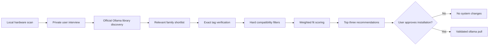

# Recommendation Methodology

Alfaifi Model Advisor uses a deterministic, explainable ranking algorithm. It
does not ask another language model to choose a winner, and it does not upload
hardware information or interview answers. Given the same hardware snapshot,
answers, and catalog data, it produces the same ranking.

This document describes the methodology implemented in version 0.2.0. The fit
score is a decision aid, not a benchmark result, probability, or guarantee of
generation quality.

## Processing pipeline



The pipeline has two ranking stages. The first stage decides which model
families deserve detailed verification. The second stage scores exact runnable
variants and produces the final recommendations.

## 1. Inputs

### Hardware snapshot

The local scanner collects:

- operating system and architecture;
- CPU name and physical/logical core counts;
- total and currently available system RAM;
- detected GPUs, dedicated VRAM, and currently free VRAM when available;
- free space in the Ollama model-storage location; and
- Ollama installation path and version.

NVIDIA VRAM is read through `nvidia-smi` when available. Windows CIM is used as
a fallback for other adapters, whose reported memory can be approximate.

### User requirements

The interview records:

- one or more goals, such as coding, agents, vision, documents, or translation;
- Arabic, English, or bilingual use;
- balanced, speed-first, quality-first, or memory-first priority;
- local-only, local-and-cloud, or cloud-acceptable execution;
- short, medium, or long context;
- image-understanding and tool-calling requirements; and
- an optional permissive-license restriction.

Experience level is collected for future presentation and guidance
personalization. In version 0.2.0 it does not change the numerical ranking.

### Model metadata

After the interview, the advisor reads the official Ollama library. It first
parses every listed family, then opens the tag and overview pages for the most
relevant families. Exact variant metadata includes:

- download size;
- context window;
- local or cloud runtime;
- parameter count when it can be identified;
- declared tools, vision, thinking, and modality badges; and
- license text when it can be identified conservatively.

Qwen, Gemma, and Kimi currently have curated family profiles with richer task
and language estimates. Newly discovered families receive conservative profiles
derived from their official description and capability badges.

## 2. Discovery shortlist

Detailed tag pages are fetched for at most 36 relevant families per interactive
run. Before shortlisting, a family is removed when it cannot satisfy a required
capability, violates local-only execution, or is clearly too large for a rough
RAM-and-disk envelope.

The remaining family relevance value is:

```text
family relevance
  = average selected-goal rating
  + 0.20 × selected-language rating
  + curated-profile bonus
  + small catalog-order tie-breaker
```

The curated-profile bonus is `0.45`. The catalog-order tie-breaker is at most
`0.35` and only stabilizes close results. This value chooses which families are
verified; it is not the final user-visible fit score.

Family pages are verified concurrently with a maximum of eight workers. This
keeps live discovery responsive without sending hundreds of unnecessary detail
requests.

## 3. Hard compatibility filters

An exact model variant is excluded before scoring when any of these conditions
is true:

1. its source is not trusted;
2. the user requested local-only execution and the variant is cloud-only;
3. the permissive-license filter is active and the license is not Apache-, MIT-,
   or BSD-style;
4. vision or tool calling is required but not declared;
5. free model-storage space is less than the download size plus a 2 GB safety
   margin; or
6. the estimated runtime memory cannot fit in VRAM, a GPU/RAM hybrid, or usable
   system RAM.

Filtering first prevents an excellent task score from hiding a model that the
device cannot practically load.

## 4. Context and memory estimate

The interview maps context preferences to a conservative starting point:

| Preference | Starting context |
| --- | ---: |
| Short | 4K |
| Medium | 8K |
| Long | 32K |

The selected value is capped at the model's declared maximum context.

For a local model, estimated runtime memory is:

```text
estimated memory (GB)
  = download size
  + 0.70
  + 0.35 × max(1, selected context / 8K)
```

The additional amount is a conservative allowance for runtime bookkeeping and
KV cache growth. It is intentionally simple and reproducible; different Ollama
versions, quantizations, prompts, and GPU backends can produce different real
usage.

Usable system RAM is estimated as:

```text
max(total RAM - 4 GB, total RAM × 0.55)
```

This preserves an operating-system reserve without treating computers with 8 GB
of RAM as completely unusable.

The execution mode is then selected in this order:

| Mode | Condition | Hardware points |
| --- | --- | ---: |
| Full GPU | Total VRAM covers estimated memory | 30 |
| Hybrid | VRAM holds a meaningful portion and RAM covers the rest | 23 |
| CPU/RAM | Usable system RAM covers estimated memory | 16 |
| Cloud | Weights are hosted remotely | 27 |

Version 0.2.0 uses total VRAM and reserved total RAM for stable fit decisions.
Instantaneous free-memory readings are displayed to the user but are not used as
hard limits because they change as applications open and close.

## 5. Capability scaling

Family-level ratings are scaled down for smaller variants so that a 0.8B model
does not inherit the full expected capability of a much larger member of the
same family.

```text
capacity factor
  = min(1.0, 0.62 + 0.12 × log2(parameter count in billions + 1))
```

Task fit is:

```text
task fit
  = average family rating for the selected goals × capacity factor
```

Language fit uses a gentler size adjustment:

```text
language fit
  = family language rating × (0.80 + 0.20 × capacity factor)
```

Both values are represented on a 0-to-5 scale before being converted to fit
points.

## 6. Speed and quality estimates

Speed begins with an execution-mode value:

| Mode | Base speed value |
| --- | ---: |
| Full GPU | 5.0 |
| Cloud | 4.0 |
| Hybrid | 3.2 |
| CPU/RAM | 2.2 |

Local variants receive a logarithmic size penalty:

```text
speed
  = max(0.5, mode base - min(2.2, 0.45 × log2(download size in GB)))
```

Quality combines task fit with a parameter-based scale estimate:

```text
parameter scale
  = min(5.0, 1.5 + 0.85 × log2(active parameters in billions + 1))

quality
  = 0.65 × task fit + 0.35 × parameter scale
```

For mixture-of-experts models, active parameters are used when known.

## 7. Final fit score

The raw score is the sum of six components:

| Component | Maximum contribution |
| --- | ---: |
| Hardware/execution fit | 30 |
| Selected-task fit | 25 |
| Language fit | 15 |
| Speed or compactness | 5, 10, or 15 |
| Estimated quality | 5, 10, or 15 |
| Source confidence | 5 |

Speed and quality always share a 20-point allocation:

| User priority | Speed/compactness | Quality |
| --- | ---: | ---: |
| Balanced | 10 | 10 |
| Maximum speed | 15 | 5 |
| Maximum quality | 5 | 15 |
| Lowest memory use | 15 compactness | 5 |

Source confidence begins at 3 points and adds:

- `2.0` for live official data;
- `1.2` for a recent local cache; or
- `0.6` for the bundled fallback catalog.

Finally, conservative uncertainty adjustments are applied:

- `-2.0` when the family was discovered dynamically rather than supported by a
  curated profile; and
- `-1.5` when the official entry does not expose a license that can be
  identified safely.

The result is rounded to one decimal place and displayed on a 100-point scale.
The currently allocated positive components total 95 points; the remaining five
points are intentionally unallocated headroom. The score should therefore be
read as a relative fit index, not a percentage or probability.

When two variants have the same rounded score, the larger parameter count wins
the tie. Only the top three eligible variants are displayed.

## 8. Worked example

Consider a Qwen 3.5 4B variant with a 3.4 GB download, 32K starting context,
live official metadata, and an 8 GB GPU.

Memory estimate:

```text
3.4 + 0.70 + 0.35 × (32 / 8) = 5.5 GB
```

Because 8 GB of VRAM is greater than the 5.5 GB estimate, the expected mode is
full GPU and receives 30 hardware points.

Its size capacity factor is approximately:

```text
0.62 + 0.12 × log2(4 + 1) = 0.899
```

If the selected goal has a Qwen family rating of 4.7 and bilingual use has a
family rating of 4.8:

```text
task fit     = 4.7 × 0.899 = 4.22 / 5
language fit = 4.8 × (0.80 + 0.20 × 0.899) = 4.70 / 5
```

Under balanced priority, the illustrative total is approximately:

```text
hardware       30.0
task           21.1
language       14.1
speed           8.4
quality         7.9
live source     5.0
--------------------------------
fit score      86.6
```

The exact value changes with the selected goals, priority, model metadata, and
source state.

## 9. Confidence labels

`High` confidence means that:

- metadata was fetched live;
- the family has a curated profile;
- the license was not left unidentified; and
- a local recommendation has a detected GPU, or the variant is cloud-hosted.

All other eligible recommendations receive `Medium` confidence. Confidence
describes metadata and fit certainty, not guaranteed answer quality.

## 10. Privacy and safety properties

- Hardware data and interview answers remain on the computer.
- Catalog requests contain no hardware profile or interview payload.
- There is no telemetry.
- Catalog and model links must use allowlisted HTTPS domains.
- Model identifiers are validated before they can reach Ollama.
- Installation uses process argument arrays rather than shell interpolation.
- `ollama pull` requires explicit user approval.

## 11. Current boundaries

The methodology is deliberately explainable, but it is still an estimator:

- task and language ratings are curated heuristics, not universal benchmark
  measurements;
- dynamic profiles infer capabilities conservatively from official descriptions
  and badges;
- CPU generation speed is not yet calibrated by processor model;
- free VRAM can change between the scan and model launch;
- runtime memory varies with quantization, backend, Ollama version, and prompt;
- the current discovery adapter covers the official Ollama library, not every
  model repository on the internet; and
- no model is downloaded and benchmarked during recommendation.

Future calibration can combine this transparent prior score with optional local
benchmarks such as load success, tokens per second, peak memory, and a small
task-specific evaluation suite.

## Implementation references

- [`src/alfaifi_model_advisor/recommender.py`](../src/alfaifi_model_advisor/recommender.py)
  contains compatibility checks, memory estimation, and final scoring.
- [`src/alfaifi_model_advisor/catalog.py`](../src/alfaifi_model_advisor/catalog.py)
  contains official-library discovery, shortlisting, verification, and caching.
- [`src/alfaifi_model_advisor/profiles.py`](../src/alfaifi_model_advisor/profiles.py)
  contains curated and dynamically inferred family profiles.
- [`src/alfaifi_model_advisor/hardware.py`](../src/alfaifi_model_advisor/hardware.py)
  contains local Windows hardware detection.

Questions, corrections, benchmark data, and reproducible calibration proposals
are welcome through the project's GitHub issues.
