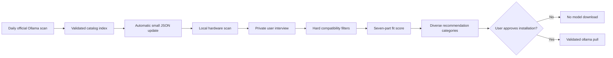

# Recommendation Methodology

Mustakshif is a deterministic, hardware-aware decision aid for the complete
official Ollama model library. It does not ask another language model to choose
a winner, does not upload hardware details or interview answers, and never
downloads model weights without explicit approval.

The score is a relative fit index. It is not a benchmark percentage, a
probability, or a guarantee of output quality.

## Design goals

The ranking engine is designed around five rules:

1. every official Ollama family is eligible for discovery;
2. the same metadata rules apply to every publisher;
3. incompatible models are filtered before quality is considered;
4. community popularity has limited influence and cannot dominate the result;
5. missing evidence lowers confidence, not the numerical score.

There are no publisher bonuses, family allowlists, or manually elevated Qwen,
Gemma, Kimi, or other brand scores.

## Processing pipeline



## 1. Complete catalog discovery

The catalog builder opens `https://ollama.com/library`, parses every official
family, and records:

- official description;
- capability badges such as tools, thinking, vision, audio, and cloud;
- advertised parameter sizes;
- total Ollama pulls;
- tag count;
- exact official update timestamp;
- canonical runnable variants;
- download size and context window;
- local or cloud runtime; and
- license text when it can be identified conservatively.

Every runnable official family is verified concurrently. The builder keeps only
canonical family variants such as `9b` or `27b`; alternative quantizations stay
available on the official model page without flooding the recommendation list.

The generated `data/catalog.json` is refreshed daily by GitHub Actions. The
desktop and CLI automatically download this small metadata file only when their
local cache is missing or older than 24 hours. If the index is unavailable,
Mustakshif uses the last validated cache and can fall back to a direct complete
Ollama scan.

## 2. Uniform capability inference

All families pass through the same rules. Official badges and description
phrases produce task metadata:

| Official evidence | Inferred capability |
| --- | --- |
| `tools`, function calling | tools and agents |
| `thinking`, reasoning, math | reasoning |
| `vision`, multimodal, visual | vision, documents, and UI understanding |
| coding, software, developer | programming and agent workflows |
| multilingual, languages, translation | translation and multilingual use |
| document, PDF, OCR, RAG | document understanding |

Publisher names are used only for display and source links. They do not change
task or language scores.

Language estimates use the same evidence policy:

- an explicit Arabic claim receives the strongest Arabic evidence;
- an explicit multilingual or translation claim receives moderate bilingual
  evidence;
- otherwise the family receives a neutral, conservative language estimate.

These values remain metadata-derived estimates. A model without a
language-specific benchmark is shown with lower confidence.

## 3. Hard compatibility filters

A variant is excluded before scoring when:

1. it is not from the validated official Ollama namespace;
2. local-only execution was requested and the variant is cloud-only;
3. a permissive license was required but could not be verified;
4. vision or tools were required but are not declared;
5. free storage is less than the download plus a 2 GB reserve; or
6. estimated runtime memory cannot fit in GPU VRAM, a GPU/RAM hybrid, or usable
   system RAM.

## 4. Context and memory

Interview choices map to 4K, 8K, or 32K starting context and are capped at the
model's declared maximum.

```text
estimated runtime memory (GB)
  = download size
  + 0.70
  + 0.35 × max(1, selected context / 8K)
```

Full-GPU classification uses only 90% of total VRAM. The remaining 10% is a
safety margin for display use, runtime variance, and metadata rounding.

```text
safe VRAM = total VRAM × 0.90
usable RAM = max(total RAM - 4 GB, total RAM × 0.55)
```

Execution points are:

| Mode | Points |
| --- | ---: |
| Full GPU after safety margin | 30 |
| GPU and system RAM hybrid | 22 |
| CPU and system RAM | 14 |
| Ollama Cloud | 25 |

Cloud does not receive the maximum because it trades local privacy and offline
availability for hardware independence.

## 5. Seven-part fit score

The score has a maximum of 100 points:

| Component | Maximum |
| --- | ---: |
| Hardware and execution fit | 30 |
| Selected task fit | 25 |
| Selected language fit | 15 |
| Speed and quality allocation | 20 |
| Community adoption | 5 |
| Freshness and maintenance | 5 |

Speed and quality share 20 points:

| Preference | Speed or compactness | Quality |
| --- | ---: | ---: |
| Balanced | 10 | 10 |
| Maximum speed | 15 | 5 |
| Maximum quality | 5 | 15 |
| Lowest memory | 15 | 5 |

### Capacity scaling

Small variants do not inherit the full family estimate:

```text
capacity factor
  = min(1.0, 0.62 + 0.12 × log2(active parameters in billions + 1))
```

For mixture-of-experts models, active parameters are used when known.

### Quality evidence

When a normalized benchmark value and source are present:

```text
quality = 70% benchmark + 30% transparent capability proxy
```

Otherwise:

```text
quality proxy
  = 58% selected-task fit
  + 42% parameter-capacity estimate
```

The interface explicitly warns when the proxy is used. It never fabricates a
benchmark result.

### Community adoption

Ollama does not expose star ratings or written user reviews. Mustakshif
therefore uses official pull counts as an adoption signal, not as proof of
quality.

```text
community points
  = log10(model pulls + 1)
  / log10(highest eligible pulls + 1)
  × 5
```

The logarithm prevents older popular families from overwhelming newer models,
and the signal is capped at 5% of the total score.

### Freshness

The official family update date maps to:

| Age | Points |
| --- | ---: |
| 30 days or less | 5.0 |
| 31–90 days | 4.5 |
| 91–180 days | 4.0 |
| 181–365 days | 3.0 |
| 366–730 days | 1.5 |
| Older | 0.5 |
| Unknown | 2.0 |

## 6. Diverse result categories

Mustakshif does not fill the screen with five sizes of the same family. It
selects distinct families where possible for:

1. **Best overall** — highest total fit score;
2. **Highest quality** — strongest quality evidence or proxy;
3. **Fastest** — strongest estimated runtime speed;
4. **Lightest** — smallest compatible local runtime footprint; and
5. **Most popular** — highest Ollama pull count among compatible models.

Each card still shows its full 100-point score and component breakdown.

## 7. Confidence and licensing

Confidence communicates evidence completeness:

- **High**: benchmark, license, and community evidence are all indexed;
- **Medium**: official popularity and update metadata are available;
- **Low**: important evidence is missing.

Unknown licenses and missing benchmarks do not receive hidden numerical
penalties. They produce visible warnings. When the user enables
“permissive licenses only,” an unknown or restrictive license becomes a hard
filter.

## 8. Security and privacy

- Hardware and interview answers stay on the device.
- The automatic download is catalog metadata, not model weights.
- Remote catalog entries are validated against canonical
  `https://ollama.com/library/<family>:<variant>` URLs.
- Install commands are reconstructed locally rather than trusted from JSON.
- Shell metacharacters and non-Ollama sources are rejected.
- `ollama pull` runs only after a separate explicit confirmation.

## 9. Known limitations

- Pull counts measure adoption, not satisfaction or correctness.
- Runtime memory varies with quantization, backend, Ollama version, prompt, and
  context usage.
- Metadata-derived task and language estimates are less reliable than
  standardized task-specific benchmarks.
- Official descriptions are publisher claims. Mustakshif labels confidence and
  sources rather than presenting them as independent measurements.
- A real local speed test after installation would be more accurate than the
  pre-installation speed estimate and is a future enhancement.

The full implementation is in:

- `src/mustakshif/catalog.py`
- `src/mustakshif/profiles.py`
- `src/mustakshif/recommender.py`
- `scripts/build_catalog.py`
- `.github/workflows/catalog.yml`
